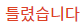

#  9375: 패션왕 신해빈 

### 문제 링크
> https://www.acmicpc.net/problem/9375

### 알고리즘 분류
>- 수학
>- 자료구조
>- 문자열
>- 해시를 사용한 집합과 맵

### 풀이 시간
>- ⏱ 50분

### 해결
>   
>1. HashMap을 사용해 2개의 반복문으로 경우의 수를 구하려고 했다. 예제는 잘나오지만 실패..
>  
> 
>1. 각각의 옷 종류 갯수에 1을 더한 값을 모두 곱해주고 1을 빼면 된다. 
